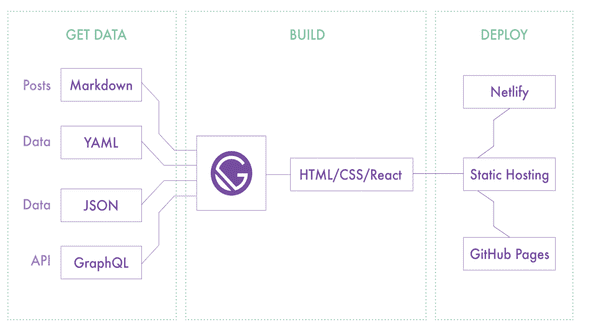

> 블로그 제작에 gatsby를 사용해본 후기입니다.

# 개발자 블로그 만들기

개발자는 모름지기 자신의 블로그가 있어야 한다고 생각했습니다.
처음에는 그래야 한다고 했기 때문에 필요성을 느꼈습니다. 하지만
점점 공부하면서는 지식이 정리가 잘 안 되고
다시 되돌아봐야 할 경우가 많아지면서 필수가 됐습니다.

블로그를 만들고 글을 정기적으로 작성하는 것은 또 다른 쉬워 보이지는 않습니다.
Gatsby로 Gemini라는 저의 블로그를 만들어 도전을 시작하려 합니다 :)

블로그 플랫폼은 다양했습니다. 전통적으로는 네이버 블로그, 티스토리 등부터
최근에는 미디엄, velog까지 다양하게 있습니다. 이미 잘 만들어 놨기 때문에 글만 작성하기 위해선,
각각의 장단점 및 특징들을 고려하여 선정만 하면 쉽게 블로그를 만들 수 있지만
직접 정성을 쏟아 내 블로그임을 뿜어내고 싶은 욕심과 무엇보다 개발자의 상징과 같은 Git를 활용하고 싶었습니다.

# Static Site Generator
오랫동안 '개발자 블로그 하면 **jekyll**이지~' 했습니다. 이후로 NodeJS가 나오면서 **Hexo**가 좋다더라 **Hugo**라는 게 있다더라 까지는 들어봤지만 최근 들어 **Gatsby**나 **Next**가 많이 쓰이고 있고 그 밖에도 정말 다양하고 많은 Static site Generator들이 있다는 것을 알게 됐습니다. ([staticgen](https://www.staticgen.com/)에서 확인)
jekyll이 대세일 때에는 그냥 고민 없이 선택의 고민이 없었을 텐데 정말 다양하고 멋있는 선택지들이 여러 개 생겨 고르기 어려웠습니다.

# 왜 때문에 Gatsby?! (vs jekyll)

블로그 만드는데 저의 *필요조건*은 다음과 같았습니다.

- Component UI
- 최신 기술 사용해 보기
- React 배워 보고 싶은 마음
- Front Matter사용
- Markdown으로 작성

사실 jekyll를 잠깐 써보다가 Gatsby를 먼저 알게 됐고 필요조건에 부합하고 너무나 멋있었기 때문에 다른 도구들은
잘 살펴보지 않았습니다. **' jekyll보다는 gatsby네! '** 느낌을 받았습니다.

~~jekyll아 미안해 ㅠㅜ 이게 별로였어..~~
- Liquid 문법 학습 필요성, 가독성 저하
- bundler 잘 사용하기 어려움
- 커스텀 하기 어려움(신경 써야 할 부분 증가, 깔끔하게 작성하기 어려움)

jeykll이 싫다면 단연 liquid때문이라고 할 수 있습니다. 템플릿 코드가 너무 지저분해 보이고 prettier와 같은 코드 정렬 도구가 없었기 때문에 너무 불편했습니다. 그리고 페이지에 기능을 적용하려면 liquid로 작성해야 하는데 view와 동작 사이에서 템플릿 문법으로 불필요하게 방해하는 느낌이었습니다.

비단 jekyll만의 특성이 아니지만, jekyll 부분부분 고쳐 쓰거나 처음부터 만들어 쓰기에는 기초가 탄탄해야 한다는 느낌을 받았습니다. 테마를 선택 했고 첫째로 디자인을 보고 고르기 때문에 해당 테마가 어떤 기능이 구현되어 있는지는 두 번째로 고려하게 됩니다. 테마별로 사용한 기술과 구현 방법이 다양해서 커스텀 하기 위해서는 상황에 맞춰 공부해야 하는 어려움이 있었습니다. (e.g. less, sass, scss.. / bootstrap, tailWindCSS ../vanila JS, jQuery, typescript / parcel, gulp, grunt)

결론, 기초가 부족하여.. <U>jekyll을 커스텀 하여 사용하는 것 보다는
잘 정리되어 있는 문서대로 따라 하고 원하는 기능을 plugin을 붙이기만 하면 되는 gatsby가 더 편리했습니다.</U>

gatsby 블로그 *충분조건*이라면 다음과 같습니다.

- morden, dev experience
- greate documentation
- gatsby plugin
- data layer
- React
- bundle
- pwa

# Build는 Netlify

Netlfy를 사용하면서 gatsby 블로그 만족도가 완성된다.

빌드, 배포, 운영을 도와주는 통합 플랫폼 

사용이 편리하고 무료로 훌륭한 기능을 제공해준다. (깃 커밋하면 build, CDN, DNS, 자동 갱신 HTTPS, CMS 등)  
gatsby build하는 시간은 생각보다 수초가 걸리는데 블로그 글만 작성하고 git에 push 해주면 된다!

# To be continue
블로그 만들며 고려했던 부분과 과정을 소개해 보려고 합니다.

---
## Reference
- [JAM Stack 개념 정리하기](https://medium.com/@pks2974/jam-stack-%EA%B0%9C%EB%85%90-%EC%A0%95%EB%A6%AC%ED%95%98%EA%B8%B0-17dd5c34edf7)
- [정적 사이트 생성기 gatsby](https://blog.outsider.ne.kr/1426)
- [What is Gatsby JS and Why Use It](https://www.youtube.com/watch?v=GuvAMcsoreI)