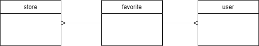

> djang-filters 사용한 문제 해결 방법 입니다.

# 상황 



- store와 user사이에 M2M throgh로 favorite 모델


# Challenge

1. 동적으로 하는 field를 ordering을 해주세요
2. model의 field이름과 다르게 parameter 받아야 해요

# 설치

```bash
$ pip install django-filter
```

# 설정

**settings.py**

```python
INSTALLED_APPS = [
    ...
    'django-filters',
]

REST_FRAMEWORK = {
    'DEFAULT_FILTER_BACKENDS': (
        'django_filters.rest_framework.DjangoFilterBackend',
    ),
}
```

# Solution 1

아래와 같이 사용 하면 `/feed/?ordering=delivery`처럼 하면 문제 해결이다.
하지만, <u> model의 property값은 ordering 할 수 없다. </u>

**app/models.py**

```python
class Store(models.Model):
    ...
    @property
    def favorite_count(self):
        return self.favorites.count()
```

**app/views.py**

```python
class InitialFeed(ListAPIView):
    """
    Feed API

    ### GET /feed/
    """
    queryset = Store.objects.all()
    serializer_class = InitialFeedSerializer
    filter_class = InitialFeedFilter
```

**app/filters.py**

```python
class InitialFeedFilter(FilterSet):
    order_by_field = 'ordering'
    ordering = OrderingFilter(
        fields=(
            ('favorite_count', 'favorite'),
            ('delivery_fee', 'delivery'),
            ('estimated_prep_time', 'time'),
        )
    )

    class Meta:
        model = Store
        fields = ['favorite_count', 'delivery_fee', 'estimated_prep_time']
```

# Solution 2

- django-fiter에서 6번째 줄에서와 같이 method를 사용하여 원하는 query를 가공한다.
- 21번째 줄에서의 fields는 6번과 같아야 하고, parameter가 된다.
- favorites만 따로 django query expression을 사용하여 ordering을 해준다. 
- `/feed/?category=delivery` 처럼 category paramater를 전달 해주면 원하는 결과를 얻을 수 있다.

**app/filters.py**

```python{6,16,21}{numberLines: true}
from django.db.models import Count
from django_filters.rest_framework import FilterSet, CharFilter
from .models import Store

class InitialFeedFilter(FilterSet):
    category = CharFilter(
        method='order_by_category', lookup_expr='exact', help_text='Feed 카테고리')

    def order_by_category(self, qs, name, value):
        qs_value = {
            'favorite': 'favorites',
            'delivery': 'delivery_fee',
            'time': 'estimated_prep_time'
        }
        if qs_value[value] == 'favorites':
            return Store.objects.annotate(favorite_counts=Count('favorites')).order_by('favorite_counts')
        return Store.objects.order_by(qs_value[value])

    class Meta:
        model = Store
        fields = ['category']
```

---
# References
- [stackoverflow](https://stackoverflow.com/questions/33691933/how-can-i-use-orderingfilter-without-exposing-the-names-of-the-fields-in-the-dat)
- [django query expression](https://docs.djangoproject.com/en/3.0/ref/models/expressions/)