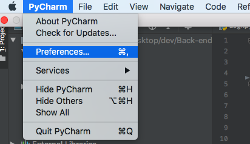
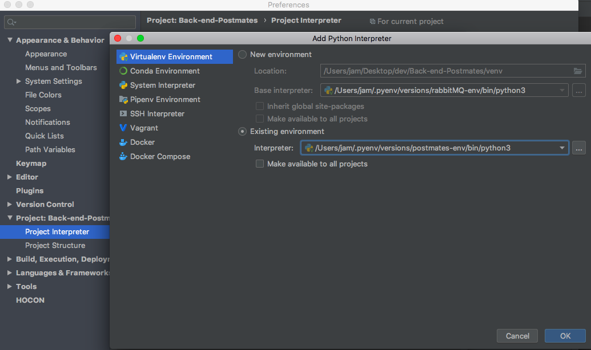
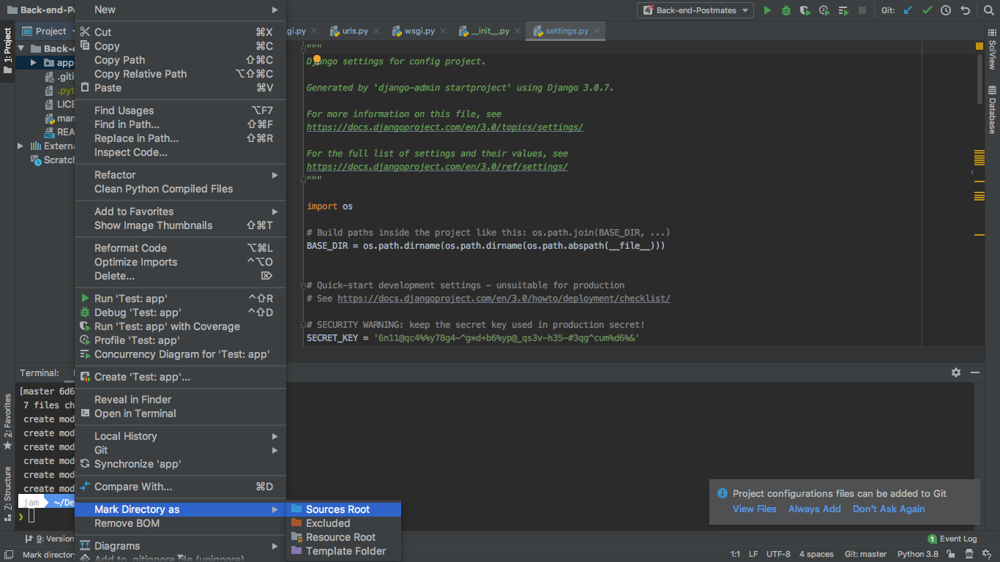
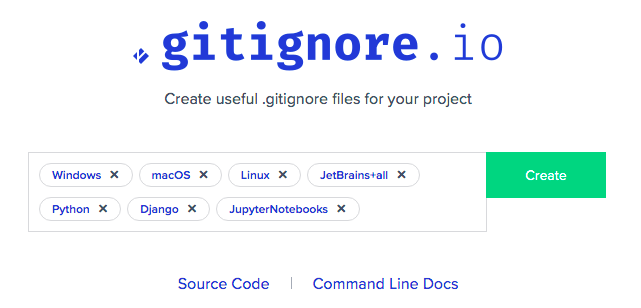

> drf 프로젝트 시작하기전 기본 세팅 내용을 정리 했습니다. 

# 기본 설치

> [poetry](https://python-poetry.org/docs/)로 dependencies를 관리 합니다.

<details><summary><b>Show Sample</b></summary>

***[tool.poetry.dependencies]***
- python = "^3.7"
- django = "^3.0.7"
- djangorestframework = "^3.11.0"
- Pillow = "^7.1.2"
- django-filter = "^2.3.0"

***[tool.poetry.dev-dependencies]***
- django-extensions = "^2.2.9"
- notebook = "^6.0.3"

</details>

**기본설치**

```bash
$ poetry init
$ poetry add django djangorestframework django-filter Pillow
```

**개발용 설치**

```bash
$ poetry add --dev django-extensions notebook
```

## 설정

### DRF
```bash
// settings.py
DJANGO_APPS = [
    ...

    # DRF
    'rest_framework',
]
```
### django-extensions, notebook
```bash
// settings.py
INSTALLED_APPS =[
	'django_extensions',
	'notebook',
]
```

**notebook으로 shell plus 실행 방법**

```bash
$ ./manage.py shell_plus --notebook
```

# pycharm

## Interpreter 설정





## Source directory 설정



# Project

## gitignore

> [gitignore.io](gitignore.io)에서 생성



## Secrets.json

production에서 rds와 s3를 사용 하기 때문에 포함 시켰습니다. 

```bash
{
    "base": {
        "HOST": "",
        "SENTRY_DSN": "<SENTRY dsn>",
        "SECRET_KEY": "<SENTRY key>",
        "DJANGO_SECRET": "6n11@qc4%%y78g4-^g*d+b6%yp@_qs3v-h35-#3qg^cum%d6%&"
    },
    "dev": {
        "DATABASES": {
            "default": {
                "ENGINE": "django.db.backends.sqlite3",
                "NAME": "db_postmates",
                "USER": "dev_postmates",
                "HOST": "localhost"
            }
        }
    },
    "production": {
        "DATABASES": {
            "default": {
                "ENGINE": "django.contrib.gis.db.backends.postgis",
                "NAME": "<RDS db_name>",
                "USER": "<RDS db_user>",
                "PASSWORD": "<RDS db_password>",
                "HOST": "<RDS Host URI>",
                "PORT": 5432
            }
        },
        "AWS_IAM_S3": {
            "AWS_ACCESS_KEY_ID": "<AWS AccessKeyID (S3 permission)>",
            "AWS_SECRET_ACCESS_KEY": "<AWS SecretAccessKey (S3 permission)>",
            "AWS_STORAGE_BUCKET_NAME": "<AWS Bucket Name>"
        }
    }
}
```

## Production / dev 분리

```bash
프로젝트 폴더
.
├── config
│   ├── __init__.py
│   ├── asgi.py
│   ├── settings
│   │   ├── __init__.py
│   │   ├── base.py
│   │   ├── dev.py
│   │   └── production.py
│   ├── urls.py
│   └── wsgi
│       ├── __init__.py
│       ├── dev.py
│       └── production.py
```

장고는 `DJANGO_SETTINGS_MODULE` 환경변수를 통해서 참고할 settings 파일 경로 확인  
`python manage.py runserver` 시에 `--settings` 옵션을 통해서 지정 가능  

```bash
# local development
python3 manage.py runserver --settings=config.settings.dev

# 환경변수 설정예시
export DJANGO_SETTINGS_MODULE=config.settings.dev
echo $DJANGO_SETTINGS_MODULE
```