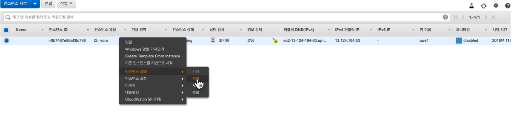
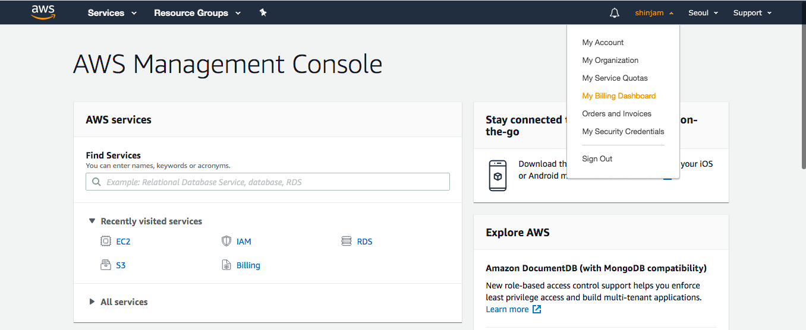
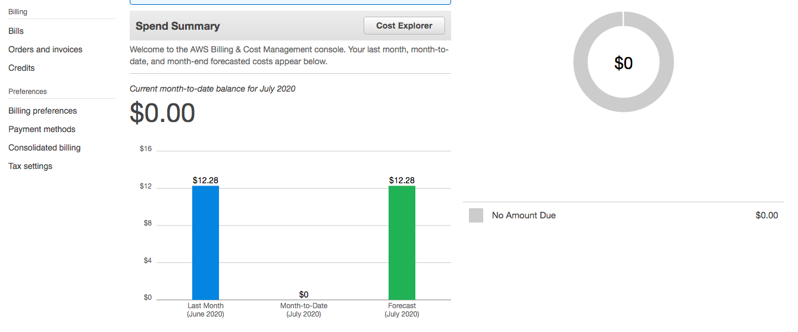

> [생활코딩과 함께하는 aws 탐구생활](https://pages.awscloud.com/cloud-in-life-coding-everybody-2020.html?trk=codingeverybody.fb) 학습 내용 입니다

# 요금

## 타입
- 온 디맨드 : 쓰는 만큼 돈을 내는 것
- 예약 인스턴스 : 쿠폰처럼 미리 사용기간을 정해 선불하여 쓰는 요금
- 스팟 인스턴스
- 전용 호스팅

## 종료
- stop : 전원이 꺼진다, 데이터는 유지 된다 -> 데이터 유지 비용, ip가 바뀜
- terminate : 컴퓨터 삭제 -> 아예 비용 없음

## 청구 확인

