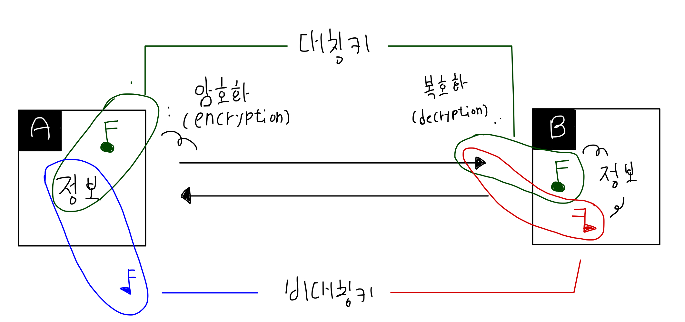

> 대칭키와 공개키를 살펴봤습니다. 

# 대칭키/비대칭키(공개키)

- 원문과 키를 이용해 암호화, 암호문을 키값을 이용해 복호화
- endpoint가 동일한 키값을 사용하면 대칭키
    - 대칭키는 private하다.
    - e.g. AES
- 공개키로 암호화, 비밀키로 복호화 하면 비대칭키
    - 공개키는 public, 비밀키는 private 하다.
    - 대칭키가 전달되는 과정에서 탈취될 가능성이 있기에 탄생한 암호화 기법
    - e.g. RSA

## Reference
- 생활코딩