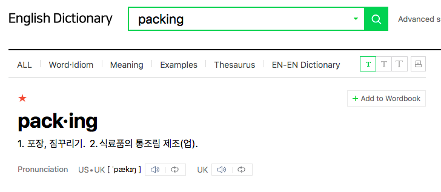

> 파이썬의 Packing, Unpakcing의 헷갈리는 쓰임을 정리합니다. 

# 개념



python에서의 포장은 container(list, tuple, str, dictionary 등)이다.  
단순하게 "<u>packing = container안에 넣기, unpacking = container에서 꺼내기</u>" 그 이상 그 이하도 아니다.

# 사용방법

보통 <u>**\* (asterisk)**를 붙이면 된다. </u>  - [* 없이 사용하는 경우](#1-대입)도 있다.

1. key, value 형태는 **\*\* (두개)**

```python
**test
```

2. 그 외에는 **\* (한개)**

```python
*test
```

# 에시
## Packing
요소들을 대입하여 특정 container에 담기

### 1. 대입

```bash
>>> a, b, *rest = 1, 2, 3, 4, 5
>>> print(a, b, rest)

1 2 [3, 4, 5]
```
### 2. 인자 전달

```bash
>>> def test(*args, **kwargs):
>>>     print(args, kwargs)
>>> test(1,2,3, a=4, b=5)

(1, 2, 3) {'a': 4, 'b': 5}
```

## Unpacking
container앞에 붙어 container 안의 요소 꺼내기

### 3. 제일 많이 사용하는 케이스

```bash
>>> a, b, c = [1,2,3]
>>> print(a, b, c)

1 2 3
```
### 4. list에 있는 요소들을 str로 출력

```bash
>>> test = [1,2,3,4,5]
>>> print(*test)

1,2,3,4,5
```
### 5. 복사할 때 사용

```bash
>>> test1 = [1,2,3,4,5]
>>> test2 = [*test1]
>>> test3 = *test1,
>>> print(id(test1), id(test2))
>>> print(test3)

4371433664 4371374960
(1, 2, 3, 4, 5)
```
### 6. 알고리즘을 풀 때 입력값 받을 때 많이 사용

```bash
number_list = [*map(int, input().split())]
```

# 특징

1. [같은 Packing인데 매개변수는 container가 tuple](#2-인자-전달)
2. [대입할 때는 container가 list](#1-대입)


# 주의사항
packing, unpacking을 할 때, 즉 * 를 쓸때는 상위 container가 있어야 한다. 

아래와 같이 하면 에러가 난다. 

```bash
*args = 1, 2, 3, 4
```

tuple로 container를 만들면 가능하다. 

```bash
>>> *args, = 1, 2, 3, 4
>>> print(args)

[1, 2, 3, 4]
```

---

# Reference
- [Unpacking generalizations](https://stackoverflow.com/questions/41251729/unpacking-generalizations)
- [Star operator on left vs right side of an assignment statement](https://stackoverflow.com/questions/35636785/star-operator-on-left-vs-right-side-of-an-assignment-statement)