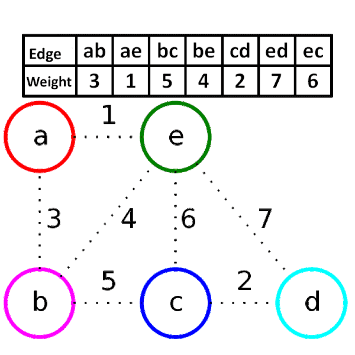

# Spanning Tree


- 그래프의 부분 집합으로 트리 형태
- 모든 정점을 연결 함
- 가장 적은 갯수의 간선으로 연결(n개의 정점에서 n - 1개의 간선)
- 사이클이 없음

# MST(Minimum Spannign Tree)

- MST = 최소 신장 트리
- Spanning Tree에서 간선들의 가중치 합이 최소인 트리

# MST 구현 방법

```python
graph = {
    'a': {'b': 3, 'e': 1},
    'b': {'a': 3, 'e': 4, 'c': 5},
    'c': {'b': 5, 'e': 6, 'd': 2},
    'd': {'c': 2, 'e': 7},
    'e': {'a': 1, 'b': 4, 'c': 6, 'd': 7}
}
edges = [(1, 'a', 'e'), (2, 'c', 'd'), (3, 'a', 'b'), (4, 'b', 'e'), (5, 'b', 'c'), (6, 'c', 'e'), (7, 'd', 'e')]
```

## Kruskal 알고리즘
모든 간선의 가중치를 **탐욕적으로(greedy)** 선택하여 간선 연결 하는 방법

### 시간 복잡도
$O(E\log{V})$

### 방법
1. 모든 가중치를 정렬한다.
2. 작은 가중치 순서대로 연결 되지 않은 정점을 연결한다. (정점 판별은 **union-find** 사용)



### 구현

```python
parent = dict()
rank = dict()


def find(node):
    # path compression 기법
    if parent[node] != node:
        parent[node] = find(parent[node])
    return parent[node]


def union(node_v, node_u):
    v_root, u_root = find(node_v), find(node_u)
    
    # union-by-rank 기법
    if rank[v_root] > rank[u_root]:
        parent[u_root] = v_root
    else:
        parent[v_root] = u_root
        if rank[v_root] == rank[u_root]:
            rank[u_root] += 1
    
    
def make_set(node):
    parent[node] = node
    rank[node] = 0

def kruskal(edges):
    mst = list()
    
    # 초기화
    for node in graph.keys():
        make_set(node)
    
    # 가중치 기준 간선 오름차순 정렬
    edges.sort()
    
    # 정점 연결
    for edge in edges:
        weight, node_v, node_u = edge
        if find(node_v) != find(node_u):
            union(node_v, node_u)
            mst.append(edge)
    
    return mst
```

```bash
>>> kruskal(edges)
[(1, 'a', 'e'), (2, 'c', 'd'), (3, 'a', 'b'), (5, 'b', 'c')]
```

## Prim 알고리즘
임의의 시작 정점부터 신장트리를 확장해 나가는 방법

### 시간 복잡도
피보나치 힙 또는 인접리스트 사용 시 : $O(E + V\log{V})$

### 방법
1. 임의의 시작정점을 정한다. 
2. 인접 정점중 최소 가중치 간선을 선택


### 구현

```python
from heapq import *

def prim(start, edges):
    mst = list()
    # 간선 정보 인접 리스트
    adj_edges = defaultdict(list)
    for w, n1, n2 in edges:
        adj_edges[n1].append((w, n1, n2))
        adj_edges[n2].append((w, n2, n1))
    # 선택 된 노드 리스트
    connected_nodes = [start]
    # 탐색 후보 간선 리스트
    candidate_edges = adj_edges[start]
    heapify(candidate_edges) # 가중치 우선순위 큐 
    
    while candidate_edges:
        w, n1, n2 = heappop(candidate_edges)
        
        if n2 not in connected_nodes:
            # n2 가 선택 안된 노드 일 때 mst 추가
            connected_nodes.append(n2)
            mst.append((w, n1, n2))
            # n2 인접 간선 탐색 후보 등록
            for edge in adj_edges[n2]:
                if edge[2] not in connected_nodes:
                    heappush(candidate_edges, edge)

    return mst
```

```bash
>>> prim(edges)
[(1, 'a', 'e'), (3, 'a', 'b'), (5, 'b', 'c'), (2, 'c', 'd')]
```

## Prim VS kruskal

### 희소 그래프(Sparse Graph)
- 간선이 적은 그래프
- 간단한 자료구조를 갖고 있는 kruskal 알고리즘이 적합

### 밀접 그래프(Dense Graph)
- 정점보다 간선이 많은 그래프
- prim 알고리즘이 적합 시간복잡도에서 차이난다.

---

## Reference
- [gmlwjd9405](https://gmlwjd9405.github.io/2018/08/28/algorithm-mst.html)
- [wiki-prim](https://ko.wikipedia.org/wiki/%ED%94%84%EB%A6%BC_%EC%95%8C%EA%B3%A0%EB%A6%AC%EC%A6%98)
- [wiki-kruskal](https://ko.wikipedia.org/wiki/%ED%81%AC%EB%9F%AC%EC%8A%A4%EC%BB%AC_%EC%95%8C%EA%B3%A0%EB%A6%AC%EC%A6%98)
- [stackoverflow](https://stackoverflow.com/questions/1195872/when-should-i-use-kruskal-as-opposed-to-prim-and-vice-versa)
- [잔재미코딩](https://www.fun-coding.org/Chapter20-kruskal-live.html)