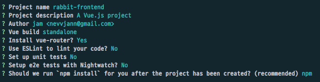

> 유저 인증 구현 입니다. 

# Django

## DRF settings

- [settings.py](http://settings.py) 에 추가

```python
INSTALLED_APPS = [
		...
    'rest_framework',
    'rest_framework.authtoken',
		...
]

REST_FRAMEWORK = {
    'DEFAULT_AUTHENTICATION_CLASSES': (
        'rest_framework.authentication.TokenAuthentication',
    ),
}
```

```bash
# authtoken migrate
$ python manage.py migrate
```

drf  앱 추가 및, Token방식 인증을 위한 설정

## Configuring User

- django 기본 유저 모델 사용
- email, username, password를 입력 받아 유저 가입
- DRF authtoken 인증 사용

`user/serializers.py` :

```python
class UserSerializer(serializers.ModelSerializer):
    class Meta:
        model = User
        fields = ['email', 'username', 'password']
        extra_kwargs = {'password': {'write_only': True}}

    def create(self, validated_data):
        user = User(
            email=validated_data['email'],
            username=validated_data['username']
        )
        user.set_password(validated_data['password'])
        user.save()
        return user
```

`user/views.py` :

```python
class UserViewSet(ModelViewSet):
    model = User
    serializer_class = UserSerializer
    queryset = User.objects.all()

    def get_object(self):
        pk = self.kwargs.get('pk', None)
        return User.objects.get(pk=pk)

class Login(APIView):
    def post(self, request, *args, **kwargs):
        data = {
            'username': self.request.data.get('username', None),
            'password': self.request.data.get('password', None),
        }
        user = authenticate(request, **data)
        token, _ = Token.objects.get_or_create(user=user)
        login(request, user)
        return Response({"auth_token": token.key}, status=status.HTTP_200_OK)
```

유저 CRUD를 위해 ModelViewSet 사용

username, password를 받아 인증 하고, token 발행

`user/urls.py` :

```python
router = DefaultRouter()
router.register(r'users', UserViewSet, basename='user')

app_name = "auth"
urlpatterns = [
    path('login/', Login.as_view()),
] + router.urls
```

**post** [localhost:8000/login](http://localhost:8000/login) → 로그인

**get** [localhost:8000/auth/users](http://localhost:8000/auth/users) → 유저 리스트

**get** [localhost:8000/auth/users/3](http://localhost:8000/auth/users/3) → 유저 정보

**patch** [localhost:8000/auth/3](http://localhost:8000/auth/3) → 유저 정보 업데이트

**delete** [localhost:8000/auth/3](http://localhost:8000/auth/3) → 유저 삭제

# Vue.js

## Make front app

`vue init webpack rabbit-front`



## Use Bootstrap4

`index.html` :

```html
<!DOCTYPE html>
<html>
  <head>
    <meta charset="utf-8">
    <meta name="viewport" content="width=device-width,initial-scale=1.0">
    <link rel="stylesheet" href="https://stackpath.bootstrapcdn.com/bootstrap/4.4.1/css/bootstrap.min.css" integrity="sha384-Vkoo8x4CGsO3+Hhxv8T/Q5PaXtkKtu6ug5TOeNV6gBiFeWPGFN9MuhOf23Q9Ifjh" crossorigin="anonymous">
    <style>
      .nav-tabs .nav-item.show .nav-link, .nav-tabs .nav-link.active {
        outline: none;
      }
    </style>

    <title>chatire-frontend</title>
  </head>
  <body>
    <div id="app"></div>
    <!-- built files will be auto injected -->
    <script src="https://code.jquery.com/jquery-3.5.1.js" integrity="sha256-QWo7LDvxbWT2tbbQ97B53yJnYU3WhH/C8ycbRAkjPDc=" crossorigin="anonymous"></script>
    <script src="https://cdn.jsdelivr.net/npm/popper.js@1.16.0/dist/umd/popper.min.js" integrity="sha384-Q6E9RHvbIyZFJoft+2mJbHaEWldlvI9IOYy5n3zV9zzTtmI3UksdQRVvoxMfooAo" crossorigin="anonymous"></script>
    <script src="https://stackpath.bootstrapcdn.com/bootstrap/4.4.1/js/bootstrap.min.js" integrity="sha384-wfSDF2E50Y2D1uUdj0O3uMBJnjuUD4Ih7YwaYd1iqfktj0Uod8GCExl3Og8ifwB6" crossorigin="anonymous"></script>
  </body>
</html>
```

## Configure Vue Router

`src/router/index.js` :

```jsx
import Vue from 'vue'
import Router from 'vue-router'
import Chat from '@/components/Chat'
import UserAuth from '@/components/UserAuth'

Vue.use(Router)

const router = new Router({
  routes: [
    {
      path: '/chats/:uri?',
      name: 'Chat',
      component: Chat
    },

    {
      path: '/auth',
      name: 'UserAuth',
      component: UserAuth
    }
  ]
})

router.beforeEach((to, from, next) => {
  if (sessionStorage.getItem('authToken') !== null || to.path === '/auth') {
    next()
  } else {
    next('/auth')
  }
})

export default router
```

`Chat.vue` : 메인 채팅 뷰

`UserAuth.vue` : 유저 인증 및 회원 가입 뷰

## Login/Signup page

```jsx
<template>
  <div class="container">
    <h1 class="text-center">Welcome to Chatire!</h1>
    <div id="auth-container" class="row">
      <div class="col-sm-4 offset-sm-4">
        <ul class="nav nav-tabs nav-justified" id="myTab" role="tablist">
          <li class="nav-item">
            <a
              class="nav-link active"
              id="signup-tab"
              data-toggle="tab"
              href="#signup"
              role="tab"
              aria-controls="signup"
              aria-selected="true"
            >Sign Up</a>
          </li>
          <li class="nav-item">
            <a
              class="nav-link"
              id="signin-tab"
              data-toggle="tab"
              href="#signin"
              role="tab"
              aria-controls="signin"
              aria-selected="false"
            >Sign In</a>
          </li>
        </ul>

        <div class="tab-content" id="myTabContent">
          <div
            class="tab-pane fade show active"
            id="signup"
            role="tabpanel"
            aria-labelledby="signin-tab"
          >
            <form @submit.prevent="signUp">
              <div class="form-group">
                <input
                  v-model="email"
                  type="email"
                  class="form-control"
                  id="email"
                  placeholder="Email Address"
                  required
                />
              </div>
              <div class="form-row">
                <div class="form-group col-md-6">
                  <input
                    v-model="username"
                    type="text"
                    class="form-control"
                    id="username"
                    placeholder="Username"
                    required
                  />
                </div>
                <div class="form-group col-md-6">
                  <input
                    v-model="password"
                    type="password"
                    class="form-control"
                    id="password"
                    placeholder="Password"
                    required
                  />
                </div>
              </div>
              <div class="form-group">
                <div class="form-check">
                  <input class="form-check-input" type="checkbox" id="toc" required />
                  <label class="form-check-label" for="gridCheck">Accept terms and Conditions</label>
                </div>
              </div>
              <button type="submit" class="btn btn-block btn-primary">Sign up</button>
            </form>
          </div>

          <div class="tab-pane fade" id="signin" role="tabpanel" aria-labelledby="signin-tab">
            <form @submit.prevent="signIn">
              <div class="form-group">
                <input
                  v-model="username"
                  type="text"
                  class="form-control"
                  id="username"
                  placeholder="Username"
                  required
                />
              </div>
              <div class="form-group">
                <input
                  v-model="password"
                  type="password"
                  class="form-control"
                  id="password"
                  placeholder="Password"
                  required
                />
              </div>
              <button type="submit" class="btn btn-block btn-primary">Sign in</button>
            </form>
          </div>
        </div>
      </div>
    </div>
  </div>
</template>

<script>
const $ = window.jQuery; // JQuery

export default {
  data() {
    return {
      email: "",
      username: "",
      password: ""
    };
  },
  methods: {
    signUp() {
      $.post("http://localhost:8000/auth/users/", this.$data, data => {
        alert(
          "Your account has been created. You will be signed in automatically"
        );
        this.signIn();
      }).fail(response => {
        alert(response.responseText);
      });
    },

    signIn() {
      const credentials = { username: this.username, password: this.password };

      $.post("http://localhost:8000/auth/login/", credentials, data => {
        sessionStorage.setItem("authToken", data.auth_token);
        sessionStorage.setItem("username", this.username);
        this.$router.push("/chats");
      }).fail(response => {
        alert(response.responseText);
      });
    }
  }
};
</script>

<style scoped>
#auth-container {
  margin-top: 50px;
}

.tab-content {
  padding-top: 20px;
}
</style>
```

`v-model`은 two-way binding으로 사용 된다. ('email', 'username', 'password') 

`@submit.prevent` 은 정의해 둔 method들에 event binding 해준다 

jQuery로 django랑 통신하기 때문에 전역으로 선언해 준다 `const $ = window.jQuery;`

## CORS 설정

`django-cors-headers` 라이브러리 사용

```bash
$ pip install django-cors-headers
```

`rabbit-backend/config/settings.py`  설정

```python
INSTALLED_APPS = [
		...

    'rest_framework',
    'rest_framework.authtoken',
    'corsheaders',
]

MIDDLEWARE = [
    ...

    'corsheaders.middleware.CorsMiddleware',

    ...
]

CORS_ORIGIN_ALLOW_ALL = True
```

# 시리즈

1. [rabbitMQ로 채팅 구현하기 1](/blog/rabbit-mq로-채팅-구현하기-1)
2. [rabbitMQ로 채팅 구현하기 2](/blog/rabbit-mq로-채팅-구현하기-2)
3. [rabbitMQ로 채팅 구현하기 3](/blog/rabbit-mq로-채팅-구현하기-3)
4. [rabbitMQ로 채팅 구현하기 4](/blog/rabbit-mq로-채팅-구현하기-4)
5. [rabbitMQ로 채팅 구현하기 5](/blog/rabbit-mq로-채팅-구현하기-5)
6. [rabbitMQ로 채팅 구현하기 6](/blog/rabbit-mq로-채팅-구현하기-6)

---

## Reference
- [github.com/danidee10/Chatire](https://github.com/danidee10/Chatire)
