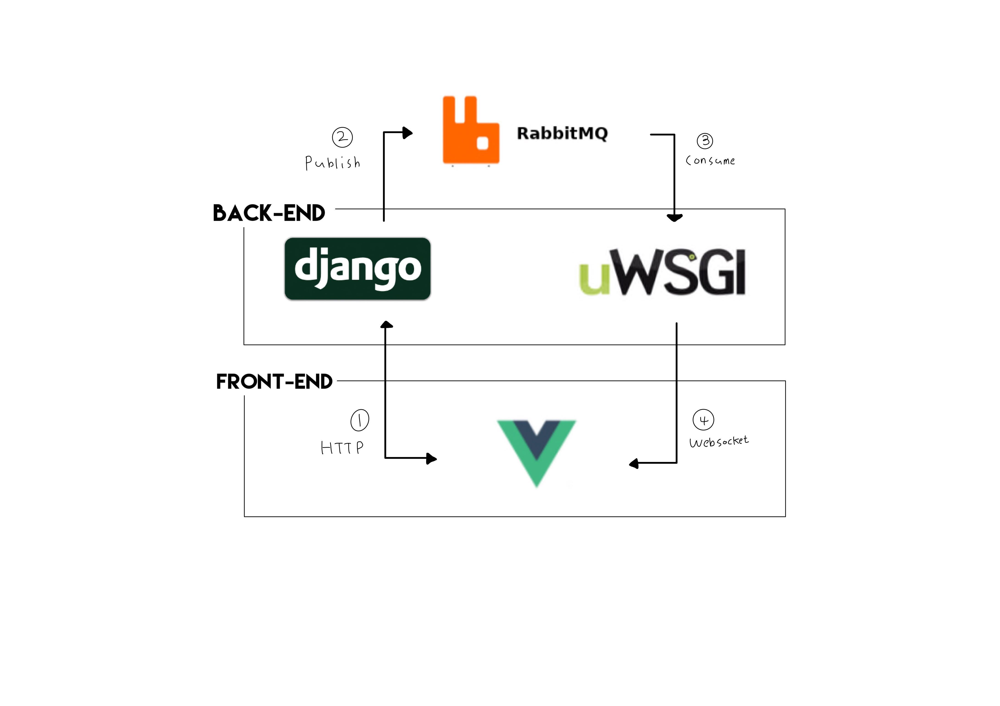

> 채팅 API 아키텍처를 설명합니다.

# Architecture



1. 유저가 메세지를 보내면 API를 통해 Django로 전달 된다.
2. Django에서 메세지를 받으면 RabbitMQ로 publish한다.
3. RabbitMQ는 exchange를 사용해 메세지를 broadcast한다. 

front에서 API서버로 메세지를 보내고 back에서는 RabbitMQ로 publish와 consume을 하게 되는 것이다. back단은 API서버와 websocket 서버가 나뉘어져 있는 거고 API서버가 publish, websocket서버인 uWSGI가 consume하게 되는 것이다. 

 API서버에서 publish 하고 front에서 직접 rabbitMQ로 부터 consume할 수 있지만, 서버에서 consume하여 얻는 이점이 있다. 

- 확장이 용이하다.
- 어플리케이션이 유연해 진다.

예를 들면, consume되기 전에 FCM을 사용한다면, push 알람을 보낼 수 있는 등 유저가 메세지를 받기전에 다른 로직을 넣을 수 있다. 또한, API서버와 분리 되어 있기 때문에 다른 어플리케이션에서 RabbitMQ로 메세지를 날렸을 때 여전히 커뮤니케이션을 할 수 있다. 

(위의 그림은 현재, 기능적인 의미에서 방향이 있지만, 4번같은 경우 uWSGI를 통해서도 메세지를 보낼 수가 있게 된다)

## Chat application

```bash
$ django-admin startapp chat
```

`settings` :

```python
INSTALLED_APPS = [
    ...

    'rest_framework',
    'rest_framework.authtoken',
    'corsheaders',

    'chat',
]
```

`[models.py](http://models.py)` :

```python
def deserialize_user(user):
    """JSON으로 인스턴스 deserialize"""
    return {
        'id': user.id, 'username': user.username, 'email': user.email,
        'first_name': user.first_name, 'last_name': user.last_name
    }

class TrackableDateModel(models.Model):
    """생성 시간, 업데이트 시간을 위한 추상 모델"""

    create_date = models.DateTimeField(auto_now_add=True)
    update_date = models.DateTimeField(auto_now=True)

    class Meta:
        abstract = True

def _generate_unique_uri():
    """채팅 세션을 위한 유니크한 uri 생성"""
    return str(uuid4()).replace('-', '')[:15]

class ChatSession(TrackableDateModel):
    """채팅 세션 모델, 생성된 uri에서 15자리를 사용"""

    owner = models.ForeignKey(User, on_delete=models.PROTECT)
    uri = models.URLField(default=_generate_unique_uri)

class ChatSessionMessage(TrackableDateModel):
    """채팅 세션에 해당하는 메세지 모델"""

    user = models.ForeignKey(User, on_delete=models.PROTECT)
    chat_session = models.ForeignKey(
        ChatSession, related_name='messages', on_delete=models.PROTECT
    )
    content = models.TextField(max_length=2000)

    def to_json(self):
        """JSON으로 메세지 deserialize"""
        return {'user': deserialize_user(self.user), 'message': self.content}

class ChatSessionMember(TrackableDateModel):
    """채팅 세션에 있는 유저 정보"""

    chat_session = models.ForeignKey(
        ChatSession, related_name='members', on_delete=models.PROTECT
    )
    user = models.ForeignKey(User, on_delete=models.PROTECT)
```

`[views.py](http://views.py)` :

```python
class ChatSessionView(APIView):
    permission_classes = (permissions.IsAuthenticated,)

    def post(self, request, *args, **kwargs):
        """채팅 세션 생성"""
        user = request.user

        chat_session = ChatSession.objects.create(owner=user)

        return Response({
            'status': 'SUCCESS', 'uri': chat_session.uri,
            'message': 'New chat session created'
        })

    def patch(self, request, *args, **kwargs):
        """채팅 세션에 사용자 추가"""
        User = get_user_model()

        uri = kwargs['uri']
        username = request.data['username']
        user = User.objects.get(username=username)

        chat_session = ChatSession.objects.get(uri=uri)
        owner = chat_session.owner

        if owner != user:  # owner가 아닌 유저만 채팅 세션 입장
            chat_session.members.get_or_create(
                user=user, chat_session=chat_session
            )

        owner = deserialize_user(owner)
        members = [
            deserialize_user(chat_session.user)
            for chat_session in chat_session.members.all()
        ]
        members.insert(0, owner)  # 맴버 리스트 첫번째에 owner 위치 

        return Response({
            'status': 'SUCCESS', 'members': members,
            'message': '%s joined that chat' % user.username,
            'user': deserialize_user(user)
        })

class ChatSessionMessageView(APIView):
    permission_classes = (permissions.IsAuthenticated,)

    def get(self, request, *args, **kwargs):
        """채팅 세션에 있는 모든 메세지 반환"""
        uri = kwargs['uri']

        chat_session = ChatSession.objects.get(uri=uri)
        messages = [chat_session_message.to_json()
                    for chat_session_message in chat_session.messages.all()]

        return Response({
            'id': chat_session.id, 'uri': chat_session.uri,
            'messages': messages
        })

    def post(self, request, *args, **kwargs):
        """create a new message in a chat session."""
        uri = kwargs['uri']
        message = request.data['message']

        user = request.user
        chat_session = ChatSession.objects.get(uri=uri)

        chat_session_message = ChatSessionMessage.objects.create(
            user=user, chat_session=chat_session, message=message
        )

        return Response({
            'status': 'SUCCESS', 'uri': chat_session.uri, 'message': message,
            'user': deserialize_user(user)
        })

def raise_404(request):
    """Raise a 404 Error."""
    raise Http404
```

ChatSesstinView의 patch메소드는 멱등성이 성립한다. 왜냐하면 채팅 세션에 유저가 들어간 정보만 있으면 되는데 여러번 들어가서 중복된 정보가 저장 되면 안되기 때문이다. 

 또한, 유저 정보를 request.data['username']으로 받으면 부가적으로 db에 select를 사용하여 소모적이고 request.use로 사용하면 간단하면서도 그러지 않고 있다. 왜냐하면 초대 기능이 있다고 생각했을때 username으로 초대 할 수 있기 때문이다.


# 시리즈

1. [rabbitMQ로 채팅 구현하기 1](/blog/rabbit-mq로-채팅-구현하기-1)
2. [rabbitMQ로 채팅 구현하기 2](/blog/rabbit-mq로-채팅-구현하기-2)
3. [rabbitMQ로 채팅 구현하기 3](/blog/rabbit-mq로-채팅-구현하기-3)
4. [rabbitMQ로 채팅 구현하기 4](/blog/rabbit-mq로-채팅-구현하기-4)
5. [rabbitMQ로 채팅 구현하기 5](/blog/rabbit-mq로-채팅-구현하기-5)
6. [rabbitMQ로 채팅 구현하기 6](/blog/rabbit-mq로-채팅-구현하기-6)

---

## Reference
- [github.com/danidee10/Chatire](https://github.com/danidee10/Chatire)
